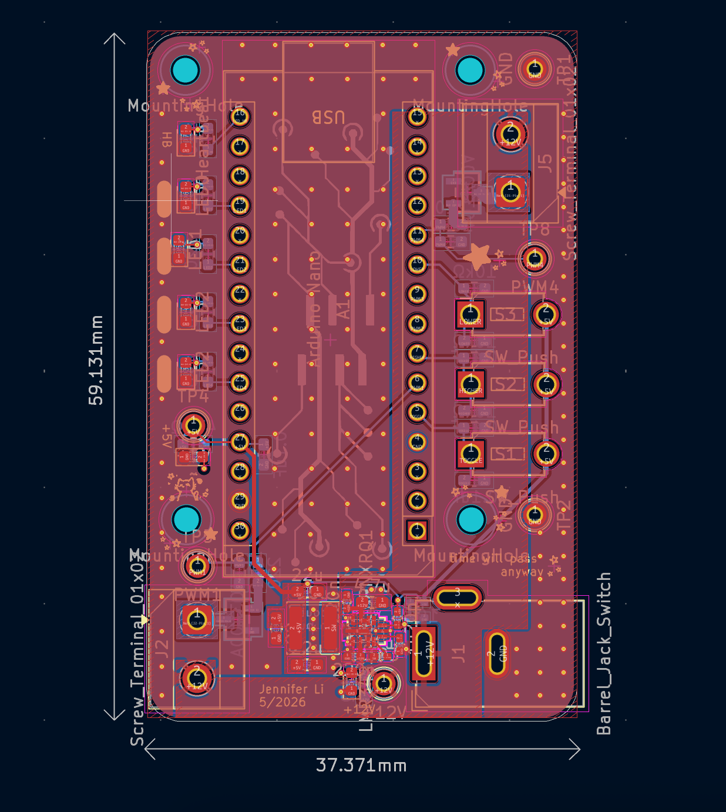
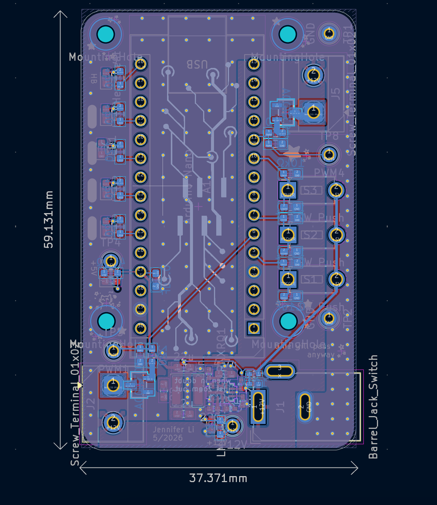
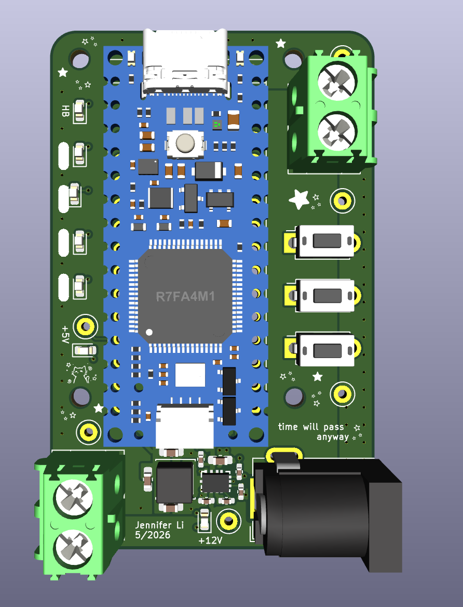
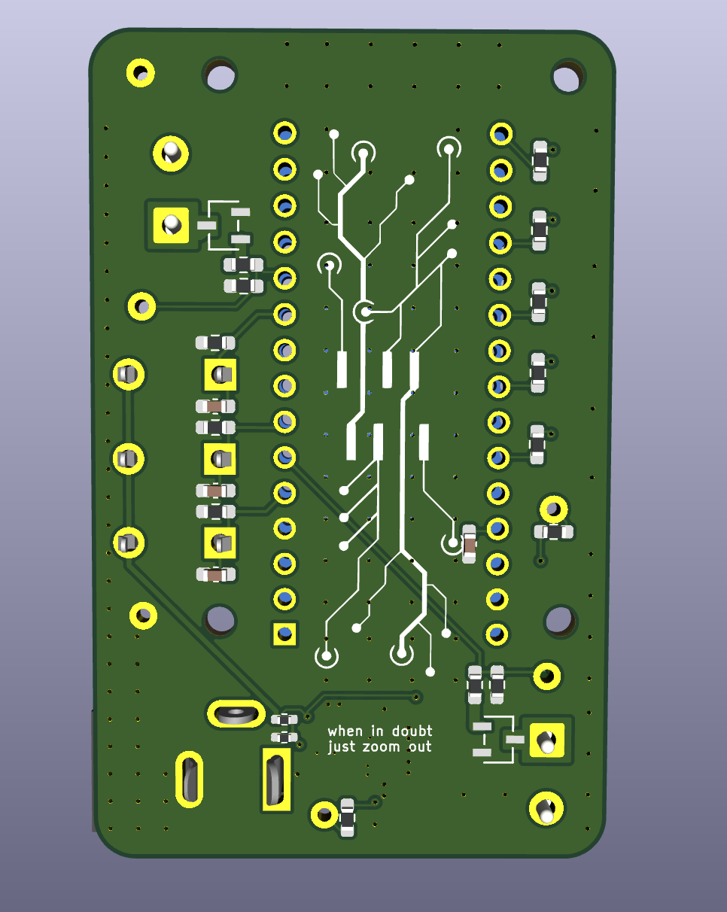
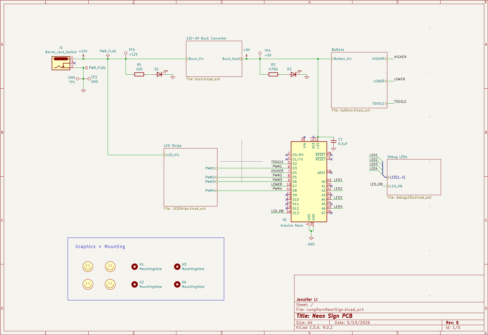

# Neon Sign Interface Board RevB - Jennifer Li

## Board Description
- Compact 2-layer PCB for PWM-controlled LED driving using nMOSFET switching and onboard 12V->5V buck regulation. Revision of neon sign project from Summer 2025 with stronger consideration for manufacturability, testability, thermal management, compact routing, and aesthetics. 
## Features
- 12V input power architecture
- 12V->5V integrated buck converter
- Multi-channel nMOSFET LED control
- Arduino-Nano based LED toggling and dimming
- Optimized for compact and clean routing
- SMT/SMD and THT assembly
- Testpoints for GND, 12V, 5V, and PWM
- Indicator LEDs with blank silkscreen for post-production debugging

## Design Notes
- The PCB was designed to be rectangular, optimizing balanced LED power distribution and component placement. Testpoints and button switches were placed along the sides for easier access in the debugging process. 
- For this design, I chose to have two LED output terminals after evaluating the maximum load requirement of the targeted LED strips. The strips I chose draw up to 5A, and thus my output circuits were designed to handle up to roughly 2.5A.
- In addition, these two terminals were placed on opposite ends of the PCB's length to simplify high-current routing, reduce congestion, and distribute power evenly across the final neon sign product without unecessary harnessing cross-over. To accomodate this placement, I used a 12V pour on the top layer in an area with minimal top-layer GND pads and minimal top-layer routing. Thus, I could provide a clean low-impedance power distribution between the input stage and the LED ouptut terminal on the opposite end of the board. 
  
## PCB Specificaitions
- Layers: 2
- PCB Thickness: 1.6 mm
- Assembly: SMT/SMD and THT
- Designed in KiCad

## Future Improvements
- Switch to addressable LED strips for firmware-controlled animation and color effects
- Transition to a fully integrated MCU system (ESP32) directly mounted on the PCB
- Use lower-profile connectors like Molex Nanofits instead of screw terminals
- Rework the user input interface, using more ergonomic control interfaces like potentiometers, rotary encoders, or low-profile switches
- Add additional protection circuitry including input fuses, TVS diodes, reverse-polarity protection, and overvoltage and undervoltage protection
- Implement per-channel current sensing and thermal monitoring
- Enable PG pin for buck converter and add output sensing

## Top Layer

## Back Layer

## 3D Render

## Root Schematic

